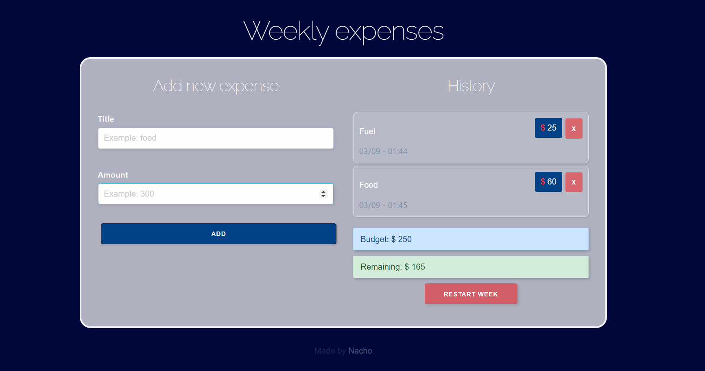

# Weekly Expenses

This is a React app to manage your weekly expenses. You can close it and keep the data saved on your browser for the next time that you open the app. This app was made using React hooks, controlled forms, skeleton, states, localStorage. Hope you like it!

 
    

#### Fun fact: the 'remaining' label changes its color to yellow or red depending on how much it is
